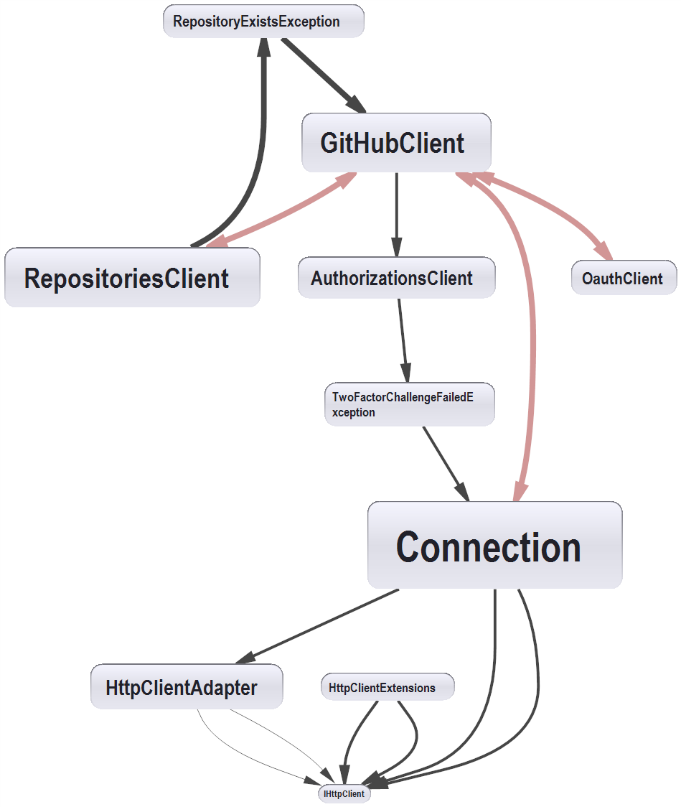

# Octokit.NET - Rewrite HTTP internals.
#### Devesh Khandelwal @devkhan
###### Proposal for *Google Summer of Code*
###### Mentoring Organization: GitHub
###### Mentor: Brendan Forster @shiftkey

**BF:** As a suggestion, a Google Doc would make for a quicker process for giving feedback and editing

### What the project is about?

I cannot summarize what this project is about better than @shiftkey has described it [here](https://github.com/octokit/octokit.net/issues/781) and [here](https://github.com/octokit/octokit.net/issues/984). But still, to show that I understand what this project aims at, I'll give it a shot.

Right now, Octokit is a very large project with a lot of conceptually different parts, loosely connected together by the efforts of some very talented people. But, still, to maintain the increasing complexity of the GitHub API, there is a need to break it down to into multiple components. One of the major components is the HTTP calling part, which is completely independent of the particulars of the API. It inlcudes re-writing the actual HTTP plumbing, getting the abstractions right, enabling Octokit's users to plug in their own HTTP client with modified behaviour such as custom caching, timeout, among other things.

**BF:** simplify this section to focus on the HTTP stack - you know enough to not need my words here :)

**I will make a lot of references to existing material and PRs, mostly from Octokit's conversations. No copyright infringement intended.**

### Why I want to do this

- Solving problems by software
	+ I feel proud if my work contributes to the betterment of current research in system and computational biology. That rewarding feeling fills me up with even more energy to keep up my work. So, if I can help anyone by the means of this project, it would be an achievement for me. I am also very much intrigued by the detailed implementation of software concepts such as data structures, algorithms, files, software development, etc.
- Working with Octokit
	+ I started a project for writing a client library (also in .NET) for the WP-API WordPress plugin, through which I learnt a lot of things. But since I was working alone on that project, it was not so much of a joy ride after a while. I have still kept in mind to complete that project one day. But knowing about Octokit.NET, going through the docs, digging deep into the classes and interfaces, writing tests, all of these have got me pretty excited about doing more and more in Octokit. In just the past two weeks, a learned so much from Octokit and the great community behind it, I'm sure, I's learn much much more if I can do a whole project under Octokit.
- Open Source 
	+ This is a fundamental and probably the most important reason for me to take up this project. During the last year and a half or so, I have come to known the real value of OSS. I am a firm believer of OSS. Nowadays, open source is an integral part of my workflow and everything I do and that is why almost all of my work has been open sourced. The first thing I do on when I open my system is open GitHub and I am constantly on the hunt for new and exciting open projects.


### What will be the outcome?™

Completion of this project will enable new possibilities for its users, some of them are as follows:

- Moving as much of the HTTP plumbing out of Octokit as possible. Providing it as a different package. It will be pluggable into the `GitHubClient`. It would be something like:

```c#
var info = new ClientInfo
{
    AppName = "my-cool-app",
    Credentials = new Credentials("my-token"),
    Server = "https://enterprise.my-work.com",
    UseDefaultProxy = true
};

var http = HttpClientFactory.Create(info);
var client = new GitHubClient(http);
```

The most important goal here is to de-couple the currently tangled up parts of Octokit. For example, hand-made HTTP requests can be made through GitHubClient.Connection. Right now, Octokit.NET does a lot of things and does so under one roof. This reduces maintainebility of Octokit and may un-necessarily breaks pparts if an even completely unrelated part is modified. Decoupling these parts will allow the development of both of them faster and leaner. Contributors can focus on parts of their choice and don't need to know the complete architecture of Octokit.

- If someone doesn't want to use the `HttpClient` used by Octokit, they can swap it with thier own HttpClient. For example, if someone wants to use their own caching implementaion or timeouts, etc., they will be able to do so by supplying their own implementation.

### Approach

The current structure of the project is as somewhat below:

- The entrypoint into the library is GitHubClient which needs an IConnection parameter either by explicitally providing a parameter or it will instantiate its own based on the options given such as ProductHeaderValue, BaseAdress, etc.
- It then creates an IApiConnection from it, which it keeps reference to and also passes onto its properties(Clients) which represents the various parts of the API.
- All of these clients call the methods of IApiConnection, which in turn calls the methods of IConnection, which finally calls out the HttpClientAdapter.
- There are also many other things, but they are secondary to the problem which this project addresses.




### Points to be focused on

- As I mentioned, the most important part is GitHubClient will take an HttpClient as a parameter instead of an IConnection, which provides a friendly wrapper around the low-level calls of HttpClientAdapter. We will have a direct dependency on System/Microsoft's HttpClient. 

- The overall structure of the HTTP internals of Octokit are represented in the figure. Ignoring the higher level types of RepositoriesClient and RepositoriesClientException, we see a direct and an indirect dependency of IGitHubClient on Connection. This is due to ctor IGitHubClient(IConnection). 

- This dependency needs to be changed or modified in order to decouple the GitHubClient and the HTTP plumbing.

- As @shiftkey attempted in #985, we have to drop the support of many ctors including the ones taking ProcutHeaderValue. This stems from the fact that ProdcutHeaderValue needs to be added to every request, and it wouldn't change for any one instance of GitHubClient. So, it will also be delegated to the HttpClient and added as one of the options of the HttpClient.

- Also, from the diagram, we can see that currently Octokit has another HTTP layer in the form of IHttpClient which is an abstraction over System/Microsoft's HttpClient. This extra layer will be removed and instead we will have a HttpClientFactory/Builder which builds upon the framework's HttpClient by changing behaviour as specified by the user in ClientOptions.

- Coming to the point of ClientInfo, we can have the following options which can be configured in the HttpClient using the Factory or Builder.
	+ AppName or ProductHeaderValue - Discussion [here](https://github.com/octokit/octokit.net/pull/985#issuecomment-163775168) by @haacked. As the GitHub API requires you to have a product header in the User Agent header or else the rate limit applies. This may be kept optional as there are some use cases where a person just want to make a few calls for one-off scripts.
	+ Authorization headers/Credentials - This is required if rate limit kicks in or accessing parts where anaonymous access isn't allowed. The reason this should be moved to the HttpClient is because it also has to be provided in the header for most of the requests.
	+ BaseAdress (in case of Enterprise) - This is pretty obvious.
	+ Timeout - As discussed in #965, the current hardcoded default value for the timeout is 100 seconds, which is sufficient for most of the cases, but in some cases may be less and in other may be too much, as the user shouldn't wait 100 seconds before getting a failure response for small queries. Whether it be globally or per-request basis as mentioned by @distantcam in #985, a configurable timeout options is required in the HttpClient.

**BF:** let's simplify this down to indicate that
  - we're aware of the relevant scenarios around controlling timeout,
  - we need to be mindful of how usable our implementation is for the consumer
  - we may need to change Octokit further, but this should not be in scope

	+ Preview headers - This can be argued over, but since some parts of the GitHub API first enter preview mode and require an extra header for accessing. One use case can be if someone explicitly is trying to test the preview features, they can fix the preview header in the HttpClient.

**BF:** as changing the `Accept` header will likely change the response content received, it is not expected that external callers will be interested in this behaviour. And if they are trying this, Octokit will likely override this when necessary and set it when invoking the preview API.

- Lack of any conversation on #530 for months shows that ther nto has been much work done for improving caching in Octokit. We can either cache the response in the HTTP layer as discussed in #369 or making a data store somewhere. If we choose the HTTP route, then it has to be done in the HTTP part.

//TODO - As I don't have much knowledge and experience in this, can you please help me out here?

**BF:** there are existing libraries out there for doing caching - Tavis.HttpCache is a good example - but as these are implemented as handlers for HttpClient you shouldn't need to worry about these in the scope of the project.

### Project Timeline

#### //TODO

**BF:** I'd love to see this section expanded on before the others

### What can be done afterwards?

#### //TODO

**BF:** let's not worry about this unless you have extra time on the proposal

### Why me?

- Eager to learn
- Relevant Skills/Experience
	+ GitHub profile
	+ Contribution to Octokit
- Past Projects
	+ Open source contributions
- Good communication
	+ Constantly updating
	+ Connectivity

### Important points/precautions/commitments/etc.

*Namaste*

